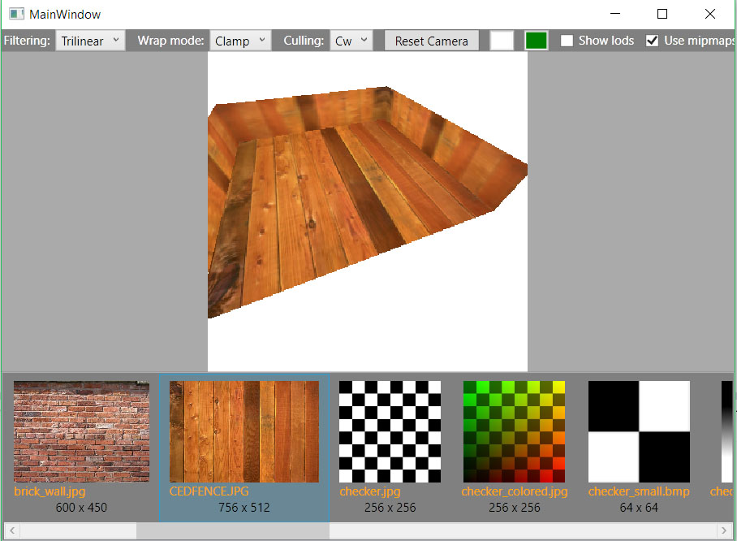
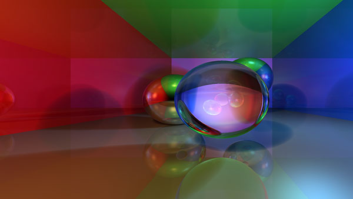

# Software Rendering project #

This project was programmed purely for my own education:
I was studying 3d model rasterization algorithms
via triangle rasterization and ray-tracing techniques.

### Triangle rasterization ###
Open `SoftwareRendering.sln`, set `TextureFilteringDev.csproj` as the StartUp project.

*Example of image produced by ray-tracer:*

### Ray-tracing ###
Open `SoftwareRendering.sln`, set `RayTrace.csproj` as the StartUp project.

*Example of image produced by ray-tracer:*

